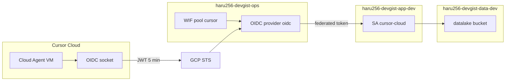
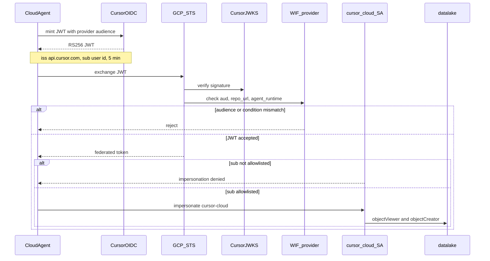

# INFRA-ADR-013 Cursor Cloud から GCP への認証に Cursor OIDC と WIF を採用する

## Conclusion (結論)

- Cursor Cloud Agent が GCP を操作するときは、Cursor が発行する短命 OIDC JWT を GCP Workload Identity Federation（WIF）で交換し、dev 用 Service Account `cursor-cloud` を impersonate する。
- Service Account JSON キーと、人間ユーザーの Application Default Credentials を Cursor 環境に置かない。
- 初期権限は `haru256-devgist-data-dev` の datalake に対する `roles/storage.objectViewer` と `roles/storage.objectCreator` に限定する。terraform apply や Cloud Run Job 起動はこの identity に含めない。
- terraform apply は GitHub Actions 側の別 WIF で行う。Cursor Cloud 用 WIF と混ぜない。

## Status (ステータス)

Accepted (承認済み) - 2026-08-26

## Context (背景・課題)

### 背景

Cursor Cloud Agent は DevGist のコードをリモート VM で実行する。crawler の GCS 書き込み確認など、GCP 上の dev リソースに触らないと検証が閉じない作業がある。

既存方針は次の通りである。

- WIF と CI 用の共通 identity は Ops Project に置く（[INFRA-ADR-004](./004-separate-tf-and-ops-projects.md)）
- ワークロード runtime SA はアプリケーション × 環境で分ける（[INFRA-ADR-007](./007-artifact-registry-and-sa-strategy.md)）
- SA ID は `<workload-or-actor>[-<purpose>]` とし、環境名は project ID で表す（[INFRA-ADR-008](./008-service-account-naming.md)）
- 秘密鍵は作らず、WIF または impersonation を使う（[service_accounts module](../../../infra/terraform/modules/service_accounts/main.tf)）
- workload 固有の cross-project IAM は SA 定義側 state で管理する（[INFRA-ADR-009](./009-cross-project-iam-ownership.md)）

Cursor 公式も、クラウドロールには Secrets に長寿命キーを置くより [OIDC tokens](https://cursor.com/docs/cloud-agent/identity) を使うことを推奨している。Cloud Agent VM は Unix socket から RS256 JWT を mint できる。issuer は `https://api.cursor.com`、有効期限は 5 分である。

AWS には `CURSOR_AWS_ASSUME_IAM_ROLE_ARN` という Cursor 公式の role assumption がある。GCP には同等の「ARN を 1 本置く」仕組みは無い。GCP 側で WIF を自分で組む必要がある。

ここで決めるのは、Cursor Cloud を GCP のどの identity として扱うか、最初に何を許可するか、誰の agent 実行を信頼するかである。

### 要件と制約

1. **長寿命の秘密を Cursor に置かない**
   - snapshot やチャット、ターミナル出力に鍵が残る経路を増やしたくない
   - 漏洩しても期限が来ない JSON キーは使わない

2. **runtime と agent の blast radius を分ける**
   - Cloud Run Job の `crawler` SA をそのまま借りると、prompt injection で本番相当の crawler 権限が使える
   - agent VM 上の任意プロセスが OIDC socket を叩ける。信用境界は「その Cloud Agent 実行全体」である

3. **今は crawler 検証、後で dev 開発全般**
   - 最初に必要なのは datalake への読書き確認である
   - 同じ identity を、後から dev の他リソースへ広げる余地を残したい
   - 広げ方は「SA を増やす」ではなく「同じ SA に IAM を足す」。そのたびに Terraform で明示する

4. **インフラ変更の実行主体を分けたい**
   - terraform apply は GitHub Actions の CI で行う
   - Cursor Cloud 用 WIF と GitHub Actions 用 WIF は別物にする

5. **既存の project / state 分割を崩さない**
   - WIF pool は ops、dev 用の操作 identity は app-dev
   - apply 順 `ops -> app` を維持し、remote state の循環を作らない

6. **信頼する Cursor 実行を絞る**
   - このリポジトリの managed Cloud Agent であること
   - 許可した Cursor `sub` であること
   - Cursor の `environment_id` を GCP に固定すると、環境作り直しのたびに Terraform が必要になる

### 比較した選択肢

#### 認証方式

| 選択肢 | 向いている用途 | メリット | デメリット | 今回の評価 |
|---|---|---|---|---|
| Option A: SA JSON キーを Cursor Secrets に置く | すぐ動かしたい場合 | 実装が短い。ADC の説明が不要 | 無期限の秘密鍵。snapshot や Runtime Secret 経由でもプロセスから読める。既存の「鍵を作らない」方針に反する | 非採用 |
| Option B: ユーザー ADC（`gcloud auth application-default login`） | 人間の手元 PC | 手元では既に使っている | Cloud Agent で対話ログインしにくい。権限が広すぎることが多い。refresh token が disk に残る | 非採用 |
| Option C: Cursor OIDC + GCP WIF + SA impersonation | Cursor / GitHub など外部実行基盤 | 鍵が無い。claim で repo と subject を縛れる。ADC の実体は credential config だけ | GCP 側に WIF と IAM の構築が要る。トークンは 5 分で切れる | 採用 |

#### GCP 上の identity

| 選択肢 | 向いている用途 | メリット | デメリット | 今回の評価 |
|---|---|---|---|---|
| Option A: Cloud Run の `crawler` SA を impersonate | agent と runtime を完全に同じ権限にしたい場合 | SA が増えない。本番パスと一致する | agent 侵害が crawler runtime と同じになる | 非採用 |
| Option B: WIF の federated principal に直接 IAM を付ける | SA を増やしたくない場合 | impersonation が無い | 監査ログ上の principal が Cursor `sub` になり、既存の SA 運用と揃わない。権限追加のたびに principal 文字列を扱う | 非採用 |
| Option C: dev 用の専用 SA `cursor-cloud` を impersonate | agent 用 identity を runtime から分け、後から権限を足したい場合 | blast radius を分けられる。名前が crawler に固定されない。監査は SA 単位 | SA が 1 つ増える。最初は datalake 以外何もできない | 採用 |

#### 信頼する Cursor 実行

| 選択肢 | 向いている用途 | メリット | デメリット | 今回の評価 |
|---|---|---|---|---|
| Option A: `repo_url` と `agent_runtime==managed` だけ | チーム全員の Cloud Agent に同じ権限を出したい場合 | 設定が少ない | このリポジトリで agent を起動できる Cursor ユーザーなら誰でも federate できる | 非採用（初期） |
| Option B: A に加え、Cursor `sub` の allowlist | 個人開発、または許可した人だけに出したい場合 | 空の allowlist なら impersonate できない。チーム化したら ID を足せる | allowlist の更新が Terraform 変数になる | 採用 |
| Option C: B に加え `environment_id` も GCP で固定 | 特定の Cursor Environment 以外を拒否したい場合 | 保存済み環境以外を切れる | 環境作り直しのたびに Terraform が必要 | 非採用 |

### 選定観点

- 長寿命の GCP 鍵を Cursor に置かないこと
- crawler runtime と Cloud Agent の権限を分けること
- 今の datalake 検証と、後の dev 開発用途を同じ identity で扱えること
- terraform apply の実行主体を GitHub Actions に残すこと
- 既存の ops / app-dev / data-dev 分割と apply 順を崩さないこと

## Considered Options

### Option A: SA JSON キーまたはユーザー ADC を Cursor に置く [却下]

Cursor Dashboard の Runtime Secret に JSON キーを置くか、snapshot に ADC を焼き込む。

却下理由:

- JSON キーは期限が来ない。漏れたあとに無効化するまで使える。
- Runtime Secret はモデル出力からは隠せるが、VM の環境変数としては残る。
- ユーザー ADC は人間の権限をそのまま agent に渡すことが多く、最小権限にならない。
- リポジトリの SA module は `generate_keys = false` であり、鍵を前提にした運用を始めてしまう。

### Option B: Cloud Run の `crawler` SA を Cloud Agent が借りる [却下]

WIF の先を既存の `crawler@haru256-devgist-app-dev.iam.gserviceaccount.com` にする。

却下理由:

- crawler Job と同じ GCS 権限に加え、将来 Job に付く権限がすべて agent に付く。
- OIDC socket は VM 内の任意プロセスが使える。crawler runtime と同じ identity にする理由が、検証の都合以外に無い。
- SA 名が crawler 固定になるため、dev 開発全般へ広げるときに名前が嘘になる。

### Option C: Cursor OIDC + WIF で `cursor-cloud` を impersonate する [採用]

ops に Cursor 用 WIF pool を置き、app-dev の `cursor-cloud` を短命 impersonate する。最初の IAM は datalake の読書きだけにする。

採用理由:

- 秘密鍵が無い。交換に使う JWT は 5 分で切れる。
- `google.subject` に Cursor `sub` を載せ、許可した subject だけ `roles/iam.workloadIdentityUser` を付ける。
- SA 名が actor 名なので、後から dev の別リソースへ権限を足しても命名を変えなくてよい。
- terraform apply 用の GitHub Actions WIF とは issuer も用途も別になる。

## Decision (決定事項)

Cursor Cloud Agent から GCP への認証は、Cursor OIDC と GCP WIF による短命 impersonation とする。借りる identity は `cursor-cloud@haru256-devgist-app-dev.iam.gserviceaccount.com` である。

### 認証の流れ

WIF は、外部 IdP が出した JWT を GCP が検証し、短命トークンに交換する仕組みである。JSON キーは無く、交換のたびに Cursor の署名と ops 上の provider 条件を見る。

役割の配置は次の通りである。



実行時は mint、交換、impersonate、アクセスの順に進む。

1. Cloud Agent が VM 内の Unix socket へ、WIF provider の既定 audience を付けて JWT を要求する。
2. Cursor が RS256 で署名した JWT を返す。`iss` は `https://api.cursor.com`、寿命は 5 分、`sub` は Cursor ユーザーの安定 ID である。
3. GCP STS が Cursor の JWKS で署名を検証し、ops の OIDC provider に照らして `aud`、`repo_url`、`agent_runtime` を確認する。
4. 条件を満たせば federated token を出す。`google.subject` は JWT の `sub` になる。
5. その `sub` が allowlist にあるときだけ、`cursor-cloud` を impersonate できる。
6. GCS への読書きは、この SA に付いた IAM で決まる。JWT 自体に GCS 権限は無い。



GitHub Actions 用 WIF はこの図に出てこない。CI の terraform apply は別 issuer、別信頼条件で組む。

### 採用方針

- Cursor Cloud に SA JSON キーもユーザー ADC も置かない
- Cloud Agent は Unix socket から OIDC JWT を mint し、GCP STS に渡す
- JWT の `aud` は WIF provider の既定 audience（canonical resource URL）に固定する。汎用の `https://iam.googleapis.com` は使わない
- issuer は `https://api.cursor.com`。JWKS は Cursor の discovery を使う
- WIF pool と OIDC provider は `haru256-devgist-ops` に置く
- impersonate 先 SA は `haru256-devgist-app-dev` の `cursor-cloud` とする。ops の `github-actions` とは別 actor である
- `cursor-cloud` は runtime SA ではない。INFRA-ADR-008 の actor 名として `github-actions` と同じ置き方をする。環境は project ID の `app-dev` で表す
- provider の attribute condition で、少なくとも次を要求する
  - `assertion.repo_url == "github.com/haru-256/devgist"`
  - `assertion.agent_runtime == "managed"`
- `roles/iam.workloadIdentityUser` は allowlist した Cursor `sub` にだけ付ける。member は `principal://iam.googleapis.com/projects/<ops_number>/locations/global/workloadIdentityPools/<pool>/subject/<sub>` 形式とする
- allowlist が空なら、pool はあっても impersonate できない
- Cursor `environment_id` は GCP の信頼条件に入れない。Environment の作り直しで Terraform を変えたくない
- `cursor-cloud` への IAM 追加は、その都度 Terraform で明示する。本 ADR は将来の権限を先に広く付与しない
- terraform apply、tfstate、Artifact Registry への push、Cloud Run Job の実行定義変更は、GitHub Actions 用の別 WIF の責務である。その設計は本 ADR の対象外とする

### 初期構成

```
haru256-devgist-ops
└── WIF
    ├── pool: cursor
    └── provider: oidc
        ├── issuer: https://api.cursor.com
        └── condition: repo_url と agent_runtime

haru256-devgist-app-dev
└── cursor-cloud@haru256-devgist-app-dev.iam.gserviceaccount.com
    ├── impersonate: 許可した Cursor sub のみ
    └── GCS IAM (data-dev datalake)
        ├── roles/storage.objectViewer
        └── roles/storage.objectCreator

GitHub Actions（別 WIF、本 ADR の外）
└── terraform apply / イメージ push など CI 操作
```

WIF の attribute mapping は少なくとも次を含める。

- `google.subject` = `assertion.sub`
- `attribute.repo` = `assertion.repo_url`
- `attribute.runtime` = `assertion.agent_runtime`

allowlist に使う `sub` は `user:<cursor_user_id>` のような安定 ID とする。`owner_email` は変わり得るので信頼条件に使わない。

`cursor-cloud` を app-dev に置く理由は、最初の権限も今後足す権限も dev の app / data 平面にあるからである。ops に置く `github-actions` は Artifact Registry と CI 用であり、用途が違う。

### 権限を広げるとき

dev 開発用途へ広げるときは、`cursor-cloud` を増やさず、app-dev state で IAM binding を足す。

足す前に、その権限が Cloud Agent 実行全体に渡ることを認めるか確認する。prod の identity や GitHub Actions 用 WIF に相乗りしない。

### 再検討条件

- Cursor が GCP 向けの公式 assume 機能を出した場合
- チーム開発になり、`sub` allowlist より `team_id` を `sub` に投影する方が運用しやすい場合
- `cursor-cloud` の権限が肥大し、workload ごとに SA を分けた方が blast radius を説明しやすい場合
- GitHub Actions 用 WIF を導入するとき、ops の pool を共有するか provider を分けるかを別 ADR で決める必要が出た場合

## Consequences (結果・影響)

### Positive (メリット)

- Cursor 環境に無期限の GCP 鍵が残らない
- crawler runtime と Cloud Agent の権限が分かれる
- SA 名を変えずに、dev 向け IAM を後から足せる
- terraform apply の実行主体が GitHub Actions に残る
- 空の allowlist では GCP 操作が始まらない

### Negative (デメリット)

- WIF と impersonation の構築が、JSON キーを 1 本置くより重い
- allowlist の Cursor `sub` は Terraform 変数で持つ。ユーザー追加のたびに app-dev の apply が要る
- OIDC socket を叩けるプロセスは、許可済みなら `cursor-cloud` として動ける。これは Cursor の trust model であり、IAM を細かくしても VM 内では分かれていない
- 初期状態では datalake 以外の検証はできない

### Risks / Future Review (将来の課題)

- `cursor-cloud` に権限を足し続けると、名前は汎用のまま実質的に何でもできる SA になる。肥大したら SA 分割を再検討する
- attribute condition の `repo_url` は primary repository だけを見る。multi-repo agent では `repo_urls` の扱いで意図より広い実行が通る可能性がある
- Cursor の JWT claim 名や issuer URL が変わった場合、WIF provider の更新が必要になる
- GitHub Actions 用 WIF を後から足すとき、ops の pool 設計を流用しすぎると信頼条件が混ざる

## Next Steps

1. Terraform で ops の Cursor 用 WIF pool / provider と、app-dev の `cursor-cloud` SA、datalake IAM、subject allowlist を定義する
2. ローカル PC から ops → app-dev の順で apply する
3. Cursor Cloud 側は、WIF の audience に合わせて OIDC を mint し、ADC が `cursor-cloud` を使う状態にする。これは本 ADR の Terraform 定義の後続作業である
4. GitHub Actions から terraform apply するための WIF は、別 ADR または別 PR で設計する

## Related Documents

- [[INFRA-ADR-004] Terraform State Project と Ops Project を分離する](./004-separate-tf-and-ops-projects.md)
- [[INFRA-ADR-007] Artifact Registry リポジトリ戦略とワークロード用 Service Account 設計](./007-artifact-registry-and-sa-strategy.md)
- [[INFRA-ADR-008] Service Account 命名規則](./008-service-account-naming.md)
- [[INFRA-ADR-009] Cross-project IAM binding の ownership](./009-cross-project-iam-ownership.md)
- [service_accounts module](../../../infra/terraform/modules/service_accounts/README.md)
- [Cursor Cloud Agent OIDC tokens](https://cursor.com/docs/cloud-agent/identity)
- [GCP Workload Identity Federation with other identity providers](https://docs.cloud.google.com/iam/docs/workload-identity-federation-with-other-providers)
