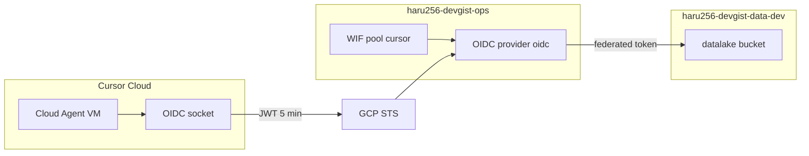
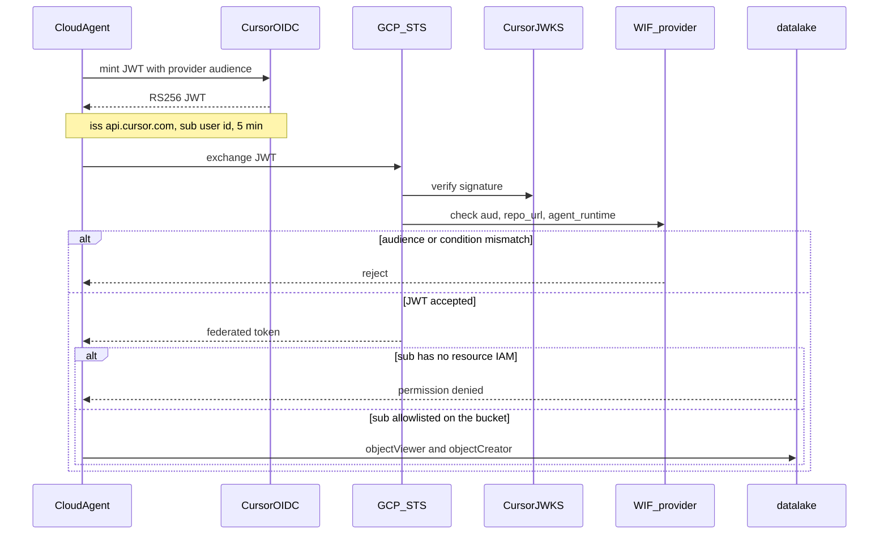

# INFRA-ADR-014 Cursor Cloud の GCP 権限は WIF federated principal への direct resource access とする

## Conclusion (結論)

- Cursor Cloud Agent が GCP を操作するときは、Cursor OIDC JWT を WIF で federated token に換え、その federated principal へリソース IAM を直接付ける。Service Account を impersonate しない。
- Service Account JSON キーと、人間ユーザーの Application Default Credentials を Cursor 環境に置かない。
- 初期権限は `haru256-devgist-data-dev` の datalake に対する `roles/storage.objectViewer` と `roles/storage.objectCreator` に限定する。terraform apply や Cloud Run Job 起動はこの identity に含めない。
- terraform apply は GitHub Actions 側の別 WIF で行う。Cursor Cloud 用 WIF と混ぜない。

## Status (ステータス)

Superseded (置き換え済み) - 2026-08-27 by [INFRA-ADR-015](./015-identity-side-guest-iam.md)

本文は書き換えない。当時の判断の記録として残す。direct resource access（SA impersonation なし、鍵を置かない、GHA 用 WIF と混ぜない）は 015 でも維持する。捨てるのは IAM binding の置き場である。app-dev に書かず ops に集めない、という判断は 015 が置き換える。

[INFRA-ADR-013](./013-cursor-oidc-workload-identity-federation.md) を supersede した経緯（impersonation から direct access）は履歴として残す。

## Context (背景・課題)

### 背景

[INFRA-ADR-013](./013-cursor-oidc-workload-identity-federation.md) は、Cursor Cloud から GCP への認証に Cursor OIDC と WIF を採用し、ops の `cursor-cloud` SA を impersonate するとした。

その直後の実装レビューで、GCP 公式が WIF の既定として **direct resource access** を推奨している点が問題になった。公式概要は次の通りである。

> We recommend that you use Workload Identity Federation to provide access directly to a Google Cloud resource. Although most Google Cloud APIs support Workload Identity Federation, some APIs have limitations. As an alternative, you can use service account impersonation.
>
> — [Workload Identity Federation](https://cloud.google.com/iam/docs/workload-identity-federation)

初期に触る API は Cloud Storage の object 読書きである。この用途は federated principal への resource IAM で足り、impersonation が必要になる制限には当たらない。

013 が SA を選んだ理由は、監査を SA 単位に揃えることと、権限追加を SA 1 本に足せることだった。direct access では監査ログの principal は Cursor `sub` になり、リソースを足すたびに同じ principal へ IAM を足す。hop が 1 段減り、`iamcredentials` も `cursor-cloud` SA も要らない。

### 要件と制約

1. **長寿命の秘密を Cursor に置かない**（013 から維持）
2. **runtime と agent の blast radius を分ける**（013 から維持。crawler SA は借りない）
3. **今は crawler 検証、後で dev 開発全般**
   - 最初は datalake の読書きだけ
   - 広げ方は「同じ federated principal に、対象リソース側 root で IAM を足す」
4. **インフラ変更の実行主体を分ける**（013 から維持。GHA 用 WIF とは別）
5. **既存の project / state 分割を崩さない**
   - WIF pool / provider は ops
   - リソース IAM は、そのリソースを既に扱っている root（初期は app-dev）
   - ops は data の remote state を読まない
6. **信頼する Cursor 実行を絞る**
   - provider condition: `repo_url` と `agent_runtime == managed`
   - リソース IAM: 許可した Cursor `sub` の `principal://.../subject/<sub>` だけ
   - `environment_id` は GCP に固定しない

### 比較した選択肢

| 選択肢 | 向いている用途 | メリット | デメリット | 今回の評価 |
|---|---|---|---|---|
| Option A: 013 どおり `cursor-cloud` を impersonate | 監査を SA email に揃えたい場合。federated identity 非対応 API がある場合 | 権限追加は SA に 1 回。既存の SA 運用と見た目が揃う | hop が増える。`iamcredentials` と SA が要る。GCP の推奨と逆 | 非採用 |
| Option B: federated principal へ direct resource access | GCS など対応済み API だけを触る場合 | hop が無い。SA が増えない。監査が Cursor `sub` そのもの | リソースを足すたびに principal 文字列へ IAM を足す | 採用 |
| Option C: Cloud Run の `crawler` SA を借りる | agent と runtime を同じ権限にしたい場合 | SA が増えない | agent 侵害が crawler runtime と同じになる | 非採用 |

### 選定観点

- GCP 公式が direct access を推奨し、impersonation を代替としていること
- 初期 API（GCS object 読書き）が federated principal をサポートしていること
- crawler runtime SA を借りないこと
- apply 順 `ops -> app` と INFRA-ADR-009 の IAM ownership を崩さないこと

## Considered Options

### Option A: `cursor-cloud` SA を impersonate する [却下]

013 の採用案。WIF のあとに `roles/iam.workloadIdentityUser` で SA を借り、SA に GCS IAM を付ける。

却下理由:

- GCP は direct access を推奨し、impersonation は API 制限があるときの代替である
- 初期に使う GCS object IAM はその制限に当たらない
- SA と IAM Credentials API が、今の要件に対して余分である

### Option B: federated principal へ direct resource access する [採用]

STS が出した federated token を、そのまま GCS などへ使う。IAM member は `principal://iam.googleapis.com/projects/<ops_number>/locations/global/workloadIdentityPools/cursor/subject/<sub>` である。

採用理由:

- GCP の推奨経路である
- impersonation hop が無い
- `cursor-cloud` SA を作らない
- allowlist が空なら、リソース IAM member が無いので GCS に届かない
- 権限を広げるときは、対象リソースを管理している root に同じ principal を足す。ops に IAM を集めない

### Option C: crawler runtime SA を借りる [却下]

013 と同じ理由で却下する。agent と Job runtime の blast radius を分けたい。

## Decision (決定事項)

Cursor Cloud Agent から GCP への認証は Cursor OIDC と WIF とする。権限は federated principal への direct resource access で付ける。`cursor-cloud` Service Account は作らない。

### 認証の流れ



1. Cloud Agent が WIF provider の既定 audience を付けて JWT を mint する
2. Cursor が RS256 JWT を返す。`iss` は `https://api.cursor.com`、寿命は 5 分、`sub` は Cursor ユーザーの安定 ID
3. GCP STS が JWKS で署名を検証し、ops の provider で `aud`、`repo_url`、`agent_runtime` を確認する
4. 条件を満たせば federated token を出す。`google.subject` は JWT の `sub`
5. GCS は、その `principal://.../subject/<sub>` に付いた IAM だけで読書きを許す。JWT 自体に GCS 権限は無い



### 採用方針

- Cursor Cloud に SA JSON キーもユーザー ADC も置かない
- Cloud Agent は Unix socket から OIDC JWT を mint し、GCP STS に渡す
- JWT の `aud` は WIF provider の既定 audience に固定する
- issuer は `https://api.cursor.com`
- WIF pool と OIDC provider は `haru256-devgist-ops` に置く。pool ID は `cursor`、provider ID は `oidc`
- impersonate 先の Service Account は置かない。`iamcredentials.googleapis.com` も Cursor 用には有効化しない
- リソース IAM は ops に集めない。INFRA-ADR-009 に従い、そのリソースを既に扱っている root が federated principal を member にする。初期の datalake 読書きは app-dev
- provider の attribute mapping は少なくとも次を含む
  - `google.subject` = `assertion.sub`
  - `attribute.repo` = `assertion.repo_url`
  - `attribute.runtime` = `assertion.agent_runtime`
- provider の attribute condition は少なくとも次を要求する
  - `assertion.repo_url == "github.com/haru-256/devgist"`
  - `assertion.agent_runtime == "managed"`
- datalake IAM の member は `principal://iam.googleapis.com/projects/<ops_number>/locations/global/workloadIdentityPools/cursor/subject/<sub>` とする。`sub` の allowlist は app-dev の変数 `cursor_oidc_subjects` に置く
- allowlist が空なら IAM member が無いので、GCS には届かない
- Cursor `environment_id` は GCP の信頼条件に入れない
- 権限追加はその都度 Terraform で明示する。本 ADR は将来の権限を先に広く付与しない
- federated identity 非対応の API が必要になったときだけ、SA impersonation を再検討する

### 初期構成

```
haru256-devgist-ops
└── WIF
    ├── pool: cursor
    └── provider: oidc
        ├── issuer: https://api.cursor.com
        └── condition: repo_url と agent_runtime

haru256-devgist-app-dev
└── GCS IAM (data-dev datalake へ federated principal を付与)
    ├── roles/storage.objectViewer
    └── roles/storage.objectCreator
        └── member: principal://.../workloadIdentityPools/cursor/subject/<allowlisted sub>

GitHub Actions（別 WIF、本 ADR の外）
└── terraform apply / イメージ push など CI 操作
```

allowlist に使う `sub` は `user:<cursor_user_id>` のような安定 ID とする。`owner_email` は使わない。

### 権限を広げるとき

同じ Cursor `sub` の principal を、対象リソースを管理している Terraform root で IAM member に足す。新しい SA は増やさない。prod リソースへ足すときは、別の明示的な判断として扱う。

### 再検討条件

- 使いたい Google Cloud API が federated identity に対応していない場合（そのときだけ SA impersonation）
- Cursor が GCP 向けの公式 assume 機能を出した場合
- チーム開発になり、`sub` allowlist より `team_id` を `sub` に投影する方が運用しやすい場合
- GitHub Actions 用 WIF を導入するとき、ops の pool を共有するか provider を分けるかを別 ADR で決める必要が出た場合

## Consequences (結果・影響)

### Positive (メリット)

- GCP 公式の推奨経路に揃う
- impersonation hop と `cursor-cloud` SA が無い
- 監査ログの principal が Cursor `sub` になる
- 空の allowlist では GCS 操作が始まらない
- terraform apply の実行主体が GitHub Actions に残る

### Negative (デメリット)

- リソースを足すたびに、同じ principal 文字列へ IAM binding を足す
- 既存の workload は SA email で監査しているので、Cursor 経路だけ principal URL になる
- allowlist の Cursor `sub` は Terraform 変数で持つ。ユーザー追加のたびに app-dev の apply が要る
- OIDC socket を叩けるプロセスは、許可済みならその `sub` として動ける

### Risks / Future Review (将来の課題)

- federated identity 非対応 API が出たら、その API だけ SA impersonation に寄せる
- app-dev 以外の root に同じ principal を足し続けると、誰が何を許可したかの見通しが SA 1 本より散らばる。Policy Analyzer で監査する
- attribute condition の `repo_url` は primary repository だけを見る
- Cursor の JWT claim 名や issuer URL が変わった場合、WIF provider の更新が必要になる

## Next Steps

1. Terraform で ops の Cursor 用 WIF pool / provider を定義する。app-dev で datalake へ federated principal の `objectViewer` / `objectCreator` を付与する
2. ローカル PC から ops → app-dev の順で apply する
3. Cursor Cloud 側は、WIF の audience に合わせて OIDC を mint し、ADC が federated token を直接使う状態にする。credential config に `service_account_impersonation_url` は入れない。手順は [docs/runbooks/cursor-cloud-oidc-wif.md](../../runbooks/cursor-cloud-oidc-wif.md)
4. GitHub Actions から terraform apply するための WIF は、別 ADR または別 PR で設計する

## Related Documents

- [[INFRA-ADR-015] data は箱とし、guest IAM は identity 定義側に書く](./015-identity-side-guest-iam.md)（現行方針。IAM の置き場）
- [[INFRA-ADR-013] Cursor Cloud から GCP への認証に Cursor OIDC と WIF を採用する](./013-cursor-oidc-workload-identity-federation.md)（superseded）
- [[INFRA-ADR-004] Terraform State Project と Ops Project を分離する](./004-separate-tf-and-ops-projects.md)
- [[INFRA-ADR-009] Cross-project IAM binding の ownership](./009-cross-project-iam-ownership.md)
- [Workload Identity Federation](https://cloud.google.com/iam/docs/workload-identity-federation)
- [Download credential configuration and grant access](https://cloud.google.com/iam/docs/workload-download-cred-and-grant-access)
