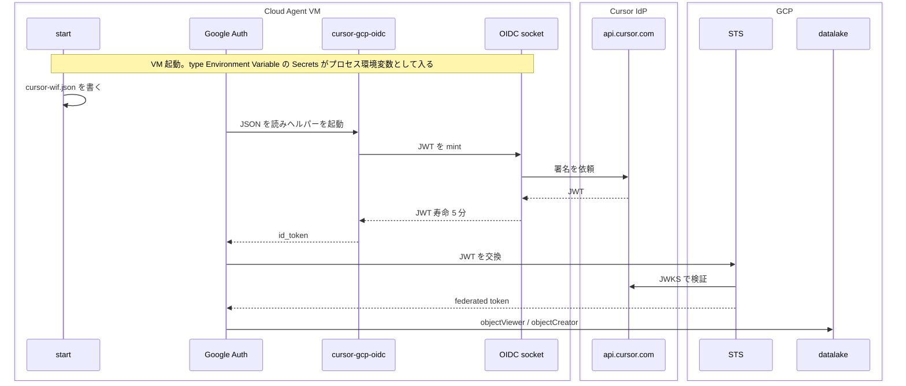

# Cursor Cloud から GCP へ OIDC / WIF で接続する

## 概要

達成したいのは、Cloud Agent が起動したあと、crawler や GCS クライアントが普通に data-dev datalake へ届くことである。鍵は置かない。人が token 交換を指示しない。ADC が mint と STS を行う。

起動時の動きは次のとおりである。



1. type `Environment Variable` の Secrets がプロセス環境変数として入った状態で VM が上がる。
2. `start` が `$HOME/.config/gcloud/cursor-wif.json` を書く。`GOOGLE_APPLICATION_CREDENTIALS` はそのパスを指す。
3. GCS などに触ると Google Auth が JSON を読む。`GOOGLE_EXTERNAL_ACCOUNT_ALLOW_EXECUTABLES=1` なので [`scripts/cursor-cloud/cursor-gcp-oidc`](../../scripts/cursor-cloud/cursor-gcp-oidc) を起動する（`jq` と `curl` が要る）。
4. ヘルパーが VM 内 socket から Cursor OIDC JWT を mint する（寿命 5 分）。`aud` は `GOOGLE_EXTERNAL_ACCOUNT_AUDIENCE` のまま。
5. GCP STS が JWKS で検証し、`repo_url` と `agent_runtime == managed` を見る。federated token を返す。
6. GCS は `principal://.../workloadIdentityPools/cursor/subject/<sub>` に付いた IAM だけで許す。

この文書は、その流れになるよう Cursor 側を配線する手順である。guest IAM の置き場は [INFRA-ADR-015](../adr/infra/015-identity-side-guest-iam.md)。認証モデル（direct resource access）は [INFRA-ADR-014](../adr/infra/014-cursor-oidc-wif-direct-resource-access.md) が決めた。WIF pool は #83。Cursor は IdP、GCP が検証する。ダッシュボードに WIF や issuer は登録しない。`allowed_audiences` が空なら GCP は canonical name を `https:` の有無どちらでも受理する（[仕様](https://cloud.google.com/iam/docs/reference/rest/v1/projects.locations.workloadIdentityPools.providers#Oidc)）。

JSON を書くスクリプトは [`scripts/cursor-cloud/setup-adc.sh`](../../scripts/cursor-cloud/setup-adc.sh) である。

## Cursor に設定するもの

入れる場所は [Cloud Agents](https://cursor.com/dashboard/cloud-agents) の **Secrets** と、保存済み **Environment** である。名前が似ているが別物である。

| ダッシュボードの名前 | 何か | この手順で触るもの |
|---|---|---|
| Secrets | 名前と値の組。type を選ぶ | type `Environment Variable` の 4 件 |
| Environment | Cloud Agent のマシン設定（`install` / `start` / ネットワーク） | `start` と、egress を制限しているときの allowlist |

Secrets の type は [Secrets & Network](https://cursor.com/docs/cloud-agent/security-network) の定義に従う。

| type | 実行時のプロセス環境変数になるか | Cloud Agent から値が見えるか | この手順での使い方 |
|---|---|---|---|
| `Environment Variable` | なる | 見える。フラグや公開 URL 向け | **この手順の値はすべてこれ** |
| `Runtime Secret` | なる | ツール結果・チャット・コミットでは `[REDACTED]` | 使わない。鍵でもない |
| `Build Secret` | ならない（Docker build だけ） | 実行中の agent には出ない | 使わない。`start` と ADC から見えない |

`Environment Variable` と `Runtime Secret` はどちらもプロセス環境変数として入る。差は agent への見せ方である。GCP の鍵はどちらにも置かない。OIDC を使う。

`CURSOR_WIF_PROJECT_NUMBER` は ops の terraform output `ops_project_number` である。

### Secrets（type は Environment Variable）

[Secrets タブ](https://cursor.com/dashboard/cloud-agents) で次を追加し、type を `Environment Variable` にする。Environment 単位でスコープできるなら、このリポジトリの Environment に付ける。

| 名前 | 値 |
|---|---|
| `CURSOR_WIF_PROJECT_NUMBER` | ops の `ops_project_number` |
| `GOOGLE_APPLICATION_CREDENTIALS` | `/home/ubuntu/.config/gcloud/cursor-wif.json`（`$HOME` が違うときは `echo $HOME` で合わせる） |
| `GOOGLE_EXTERNAL_ACCOUNT_ALLOW_EXECUTABLES` | `1` |
| `DATA_LAKE_BUCKET_NAME` | crawler を動かすなら `haru256-devgist-data-dev-datalake` |

`GOOGLE_APPLICATION_CREDENTIALS` は鍵ではなく、`start` が書く JSON のパスである。

type を `Runtime Secret` にすると、agent は値を `[REDACTED]` としか見えない。プロジェクト番号やパスの確認ができなくなる。type を `Build Secret` にすると、`start` も Google Auth も読めない。

### Environment（マシン設定）

保存済み Environment は「どの VM で agent を起動するか」である。Secret の type `Environment Variable` ではない。プロセス環境変数の一覧でもない。変数は上の Secrets から入る。

| 項目 | 値 |
|---|---|
| `start` | `scripts/cursor-cloud/setup-adc.sh` |
| Network（egress を制限しているときだけ） | Environment の network access に `sts.googleapis.com`、`iam.googleapis.com`、`storage.googleapis.com`、`www.googleapis.com`、`oauth2.googleapis.com` を足す |

既存の `install` / snapshot は残す。リポジトリに `.cursor/environment.json` は置かない。`install` で export した変数は Build 後に残らない。mint 自体は VM 内の Unix socket で、allowlist は不要である。ネットワークの階層は [Secrets & Network](https://cursor.com/docs/cloud-agent/security-network#network-access) を見る。

### 置かないもの

- Service Account JSON キー、人間ユーザーの ADC（type `Runtime Secret` でも置かない）
- WIF pool / provider / issuer（Cursor 側に登録する欄は無い）
- `service_account_impersonation_url`（`gcloud ... create-cred-config` に `--service-account` を付けない）
- `cursor_oidc_subjects`（Cursor ではなく ops の gitignore 済み `terraform.tfvars`）

## 手順

1. data-dev を apply し、datalake 箱を先に作る。
2. ops を apply し、`ops_project_number` を控える。gitignore 済み `terraform.tfvars` の `cursor_oidc_subjects` に、許可する Cursor `sub` を入れる。例: `["user:308716925"]`。`sub` はメールではない。空なら WIF は通っても GCS は拒否する。
3. Secrets に上の 4 件を type `Environment Variable` で入れる。Environment の `start` に `setup-adc.sh` を入れる。egress を制限しているなら GCP ホストを Environment の allowlist に足す。
4. 新しい Cloud Agent を起動する。`start` が `$HOME/.config/gcloud/cursor-wif.json` を書く。`command` は checkout した `cursor-gcp-oidc` の絶対パスである。

## 動作確認

WIF と allowlist の apply、Cursor の設定、`start` 済みが前提。本線は ADC が token を取れることである。type `Environment Variable` の値が入っていれば export は不要。

```bash
gcloud auth application-default print-access-token >/dev/null
```

mint ヘルパーだけを試すときは audience を渡す。値は付け替えない。

```bash
export GOOGLE_EXTERNAL_ACCOUNT_AUDIENCE="//iam.googleapis.com/projects/${CURSOR_WIF_PROJECT_NUMBER}/locations/global/workloadIdentityPools/cursor/providers/oidc"
scripts/cursor-cloud/cursor-gcp-oidc | jq -r '.success'
```

ヘルパーのテストは `python3 scripts/cursor-cloud/tests/test_scripts.py`。

## うまくいかないとき

| 症状 | 見るところ |
|---|---|
| `jq is required` | Cloud Agent の PATH に `jq` が無いか |
| `executables need to be explicitly allowed` | Secrets の `GOOGLE_EXTERNAL_ACCOUNT_ALLOW_EXECUTABLES` が type `Environment Variable` で `1` か |
| credential ファイルが無い | `start` に `setup-adc.sh` があるか。`CURSOR_WIF_PROJECT_NUMBER` の type が `Environment Variable` か。`Build Secret` になっていないか |
| 値が `[REDACTED]` になる | type が `Runtime Secret` になっていないか。この手順の値は `Environment Variable` |
| STS が audience 不一致 | JWT `aud` が canonical name か。`allowed_audiences` にカスタム値だけを入れてないか |
| mint は成功、GCS が 403 | `cursor_oidc_subjects` と JWT `sub` |
| `OIDC socket not found` | `/run/cursor/api.sock`。Cursor 管理 VM 以外では無い |
| credential JSON に `service_account_impersonation_url` がある | `--service-account` を付けて生成している。Cloud Agent では `setup-adc.sh` を使う |

JSON を手元で書くときも `--service-account` は付けない。

```bash
gcloud iam workload-identity-pools create-cred-config \
  "projects/${CURSOR_WIF_PROJECT_NUMBER}/locations/global/workloadIdentityPools/cursor/providers/oidc" \
  --subject-token-type=urn:ietf:params:oauth:token-type:id_token \
  --executable-command="$(pwd)/scripts/cursor-cloud/cursor-gcp-oidc" \
  --output-file="${HOME}/.config/gcloud/cursor-wif.json"
```
