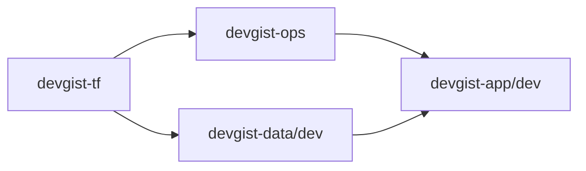

# Infrastructure

アプリケーションを稼働させるためのインフラ構成コードを管理するディレクトリです。

## 役割

- **Terraform**: クラウドプロバイダー（AWS/GCPなど）のリソース管理。
- **Kubernetes**: アプリケーションのデプロイメント設定（Manifests, Helm Chartsなど）。
- CI/CDパイプラインに関連するスクリプトや設定。

## 関連 ADR

インフラに関する Architecture Decision Record (ADR) は [docs/adr/](../docs/adr/) 配下で管理します。

- 運用ガイド: [docs/adr/README.md](../docs/adr/README.md)
- テンプレート: [docs/adr/_template.md](../docs/adr/_template.md)
- `INFRA-ADR-001`: [docs/adr/infra/001-gcp-project-structure.md](../docs/adr/infra/001-gcp-project-structure.md)
- `INFRA-ADR-002`: [docs/adr/infra/002-terraform-module-structure.md](../docs/adr/infra/002-terraform-module-structure.md)
- `INFRA-ADR-003`: [docs/adr/infra/003-crawler-execution-platform.md](../docs/adr/infra/003-crawler-execution-platform.md)
- `INFRA-ADR-004`: [docs/adr/infra/004-separate-tf-and-ops-projects.md](../docs/adr/infra/004-separate-tf-and-ops-projects.md)
- `INFRA-ADR-005`: [docs/adr/infra/005-terraform-environment-slicing.md](../docs/adr/infra/005-terraform-environment-slicing.md)
- `INFRA-ADR-006`: [docs/adr/infra/006-cross-project-output-sharing.md](../docs/adr/infra/006-cross-project-output-sharing.md)

このディレクトリ配下の `infra/docs/adr/` は互換性維持のための参照パスであり、正本は [docs/adr/](../docs/adr/) 側です。

## Current GCP Project Responsibilities

現時点の想定 GCP project 構成は、`tf` と `ops` を分離した 4 系統です。

```mermaid
graph TD
    TF[haru256-devgist-tf<br/>Terraform state only]
    OPS[haru256-devgist-ops<br/>Artifact Registry / CI-CD]
    DATA[haru256-devgist-data-{env}<br/>Stateful data]
    APP[haru256-devgist-app-{env}<br/>Stateless compute]

    OPS --> APP
    APP --> DATA
```

- `haru256-devgist-tf`
  - Terraform state bucket 専用 project
  - 原則として tfstate 管理以外の常設リソースは置かない

- `haru256-devgist-ops`
  - Artifact Registry
  - GitHub Actions 連携、WIF、共通 CI/CD 用 Service Account などの運用基盤

- `haru256-devgist-data-{env}`
  - GCS datalake
  - Cloud SQL / BigQuery など stateful data

- `haru256-devgist-app-{env}`
  - Cloud Run Jobs
  - frontend / backend API など stateless compute

### Responsibility Notes

- crawler の image store は `ops` project 側の `Artifact Registry` に置く
- crawler の実行先は `app` project 側の `Cloud Run Jobs` とする
- crawler の保存先 datalake は `data` project 側に置く
- project 構成の判断根拠は `INFRA-ADR-001` から `INFRA-ADR-006` を参照する

## Service To Project Mapping

`crawler` は 1 つの environment に閉じず、`ops / app / data` の各 project に責務を分解して配置します。

| Service | Project | Responsibility | Source of Truth |
|---|---|---|---|
| `crawler` | `haru256-devgist-ops` | `Artifact Registry` repository | `devgist-ops` Terraform state |
| `crawler` | `haru256-devgist-app-dev` | `Cloud Run Jobs` / app runtime | `devgist-app/dev` Terraform state |
| `crawler` | `haru256-devgist-data-dev` | `GCS datalake` などの保存先 | `devgist-data/dev` Terraform state |

## Terraform Apply Order

project ごとに state を分けているため、`crawler` 関連の apply は依存順に実行します。



### Order

1. `devgist-tf`
   - tfstate bucket を先に作成する
2. `devgist-ops`
   - `Artifact Registry` など共通運用基盤を作成する
3. `devgist-data/dev`
   - datalake など crawler の保存先を作成する
4. `devgist-app/dev`
   - `terraform_remote_state` で `ops/data` の outputs を参照しながら app 側 compute を作成する

### Notes

- `devgist-app/dev` は `devgist-ops` と `devgist-data/dev` の outputs を `terraform_remote_state` で参照する
- secret は Terraform outputs では渡さず、`GCP Secret Manager` を app runtime から参照する
- 旧 `environments/crawler` は legacy 扱いで、最終的には `ops/app/data` 側へ整理する
