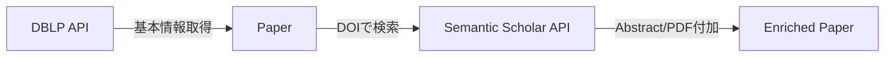

# Crawler

学術論文のメタデータを収集し、充実させるWebクローラー。

DBLP Computer Science Bibliographyから主要な推薦システム・データマイニング系カンファレンスの論文情報を取得し、Semantic Scholar APIを使用して要約やPDF URLを付加します。

## 対象カンファレンス

- RecSys (ACM Conference on Recommender Systems)
- KDD (Knowledge Discovery and Data Mining)
- WSDM (Web Search and Data Mining)
- WWW (The Web Conference)
- SIGIR (Special Interest Group on Information Retrieval)
- CIKM (Conference on Information and Knowledge Management)

## 処理フロー



1. **DBLP APIからの基本情報取得**
   - 各カンファレンスでアクセプトされた論文のタイトル、著者、年度、DOIを取得
   - robots.txtを尊重し、適切なレート制限を実施

2. **Semantic Scholarでの充実**
   - DOIを使用して各論文の詳細情報を取得
   - Abstract（要約）とPDF URLを付加
   - arXivリンクが含まれる場合は、arXiv PDFへのリンクを取得

## ディレクトリ構成

```
crawler/
├── domain/              # ドメインモデル層
│   ├── __init__.py
│   └── paper.py         # 論文を表すPaperモデル
├── libs/                # 共有ライブラリ
│   └── __init__.py      # RobotGuard（robots.txt処理）
├── usecase/             # ユースケース層（ビジネスロジック）
│   ├── __init__.py
│   ├── dblp.py          # DBLP API連携クラス
│   └── semantic_scholar.py  # Semantic Scholar API連携クラス
├── tests/               # 単体テスト
│   ├── test_dblp.py
│   ├── test_libs.py
│   ├── test_paper.py
│   └── test_semantic_scholar.py
├── main.py              # エントリーポイント
├── config.toml          # 設定ファイル
├── pyproject.toml       # プロジェクト設定
└── README.md
```

## 主要コンポーネント

### Domain層

#### `Paper` (domain/paper.py)

論文のメタデータを表すドメインモデル。

**必須フィールド:**

- `title`: 論文タイトル
- `authors`: 著者リスト
- `year`: 出版年
- `venue`: 掲載会場（カンファレンス名）

**オプションフィールド:**

- `doi`: Digital Object Identifier
- `type`: 論文の種類
- `ee`: 電子版へのリンク
- `pdf_url`: PDFへのリンク
- `abstract`: 論文の要約

### UseCase層

#### `DBLPSearch` (usecase/dblp.py)

DBLP APIから論文の基本情報を取得するクラス。

**主要メソッド:**

- `fetch_papers(conf, year, h)`: 指定カンファレンス・年度の論文を取得

**特徴:**

- robots.txtの自動チェック
- バッチ取得による効率的な処理
- 必須フィールドの検証とスキップ

#### `SemanticScholarSearch` (usecase/semantic_scholar.py)

Semantic Scholar APIから論文の詳細情報を取得するクラス。

**主要メソッド:**

- `enrich_papers(papers)`: 論文リストを要約・PDF URLで充実

**特徴:**

- バッチAPIによる効率的な処理
- arXivリンクの自動検出と変換
- 元のPaperオブジェクトを変更せず、新規作成

### Libs層

#### `RobotGuard` (libs/**init**.py)

robots.txtの取得・解析を行い、クロール可否を判定するクラス。

**主要メソッド:**

- `load(client)`: robots.txtをロード
- `can_fetch(url)`: URLのクロール可否を判定
- `get_crawl_delay()`: Crawl-delay設定を取得

## セットアップ

### 必要要件

- Python 3.13以上
- uv (Pythonパッケージマネージャー)

### インストール

```bash
cd workflows/crawler
uv sync
```

## 使用方法

### 基本的な実行

```bash
uv run python main.py
```

### プログラムからの使用

```python
import asyncio
from usecase.dblp import DBLPSearch
from usecase.semantic_scholar import SemanticScholarSearch

async def fetch_recsys_papers():
    headers = {"User-Agent": "YourBot/1.0"}
    
    # DBLPから基本情報を取得
    async with DBLPSearch(headers) as dblp:
        papers = await dblp.fetch_papers(conf="recsys", year=2025, h=1000)
    
    # Semantic Scholarで充実
    async with SemanticScholarSearch(headers) as scholar:
        enriched_papers = await scholar.enrich_papers(papers)
    
    return enriched_papers

asyncio.run(fetch_recsys_papers())
```

## テスト

### 全テストの実行

```bash
uv run pytest -v
```

### 特定のテストファイルの実行

```bash
uv run pytest tests/test_semantic_scholar.py -v
```

### テストカバレッジ

- **DBLP**: 11テスト
- **Libs (RobotGuard)**: 5テスト
- **Paper**: 15テスト
- **SemanticScholar**: 17テスト

**合計: 48テスト**

## コード品質チェック

### 型チェック

```bash
uv run mypy .
```

### リントチェック

```bash
uv run ruff check .
```

### すべてのチェックを一度に実行

```bash
make check
```

## アーキテクチャの特徴

### レイヤードアーキテクチャ

- **Domain層**: ビジネスロジックから独立したモデル定義
- **UseCase層**: ビジネスロジックの実装
- **Libs層**: 汎用的な共通機能

### 非同期処理

全てのHTTP通信は`httpx`の非同期クライアントを使用し、効率的な並列処理を実現。

### コンテキストマネージャー

APIクライアントは非同期コンテキストマネージャーとして実装され、リソースリークを防止。

### テスト駆動

全てのクラスとメソッドに対して包括的な単体テストを実装。

## 注意事項

### robots.txtの尊重

このクローラーはrobots.txtを自動的にチェックし、クロールが許可されている場合のみリクエストを実行します。

### レート制限

- 同時接続数: 最大100
- Keep-Alive接続: 最大20
- タイムアウト: 30秒

### User-Agent

必ず適切なUser-Agentを設定してください。

```python
headers = {"User-Agent": "YourBotName/Version (contact@example.com)"}
```

## ライセンス

このプロジェクトは教育・研究目的で使用されます。外部APIの利用規約を遵守してください。

## 開発

### 新しい依存関係の追加

```bash
uv add package-name
```

### 開発依存関係の追加

```bash
uv add --group test package-name
```

## トラブルシューティング

### SSL証明書エラー

`certifi`と`truststore`パッケージがインストールされていることを確認してください。

### タイムアウトエラー

ネットワーク状況に応じて`timeout`パラメータを調整してください。

### テスト失敗

- 依存関係が最新か確認: `uv sync`
- キャッシュをクリア: `rm -rf .pytest_cache .mypy_cache .ruff_cache`
