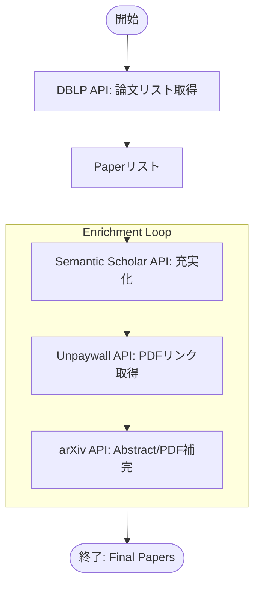

# Crawler

学術論文のメタデータを収集し、充実させるWebクローラー。

DBLP Computer Science Bibliographyから主要な推薦システム・データマイニング系カンファレンスの論文情報を取得し、Semantic Scholar・Unpaywall・arXivの各APIで要約やPDF URLを付加します。

## 対象カンファレンス

- RecSys (ACM Conference on Recommender Systems)
- KDD (Knowledge Discovery and Data Mining)
- WSDM (Web Search and Data Mining)
- WWW (The Web Conference)
- SIGIR (Special Interest Group on Information Retrieval)
- CIKM (Conference on Information and Knowledge Management)

## 処理フロー



1. **DBLP APIからの基本情報取得**
   - 各カンファレンスでアクセプトされた論文のタイトル、著者、年度、DOIを取得
   - robots.txtを尊重し、適切なレート制限を実施

2. **Semantic Scholarでの充実**
   - DOIを使用して各論文の詳細情報を取得
   - Abstract（要約）とPDF URLを付加

3. **UnpaywallでのPDF取得**
   - DOIを使用してUnpaywallからオープンアクセスPDFを取得

4. **arXivでの充実**
   - DOIまたはタイトルでarXivを検索
   - AbstractとPDF URLを補完

## ディレクトリ構成

```text
src/crawler/
├── domain/              # ドメインモデル層
│   ├── __init__.py
│   ├── paper.py         # 論文を表すPaperモデル
│   └── repository.py    # リポジトリ等のインターフェース定義
├── repository/          # リポジトリ層（データアクセス）
│   ├── __init__.py
│   ├── arxiv_repository.py            # arXiv API連携クラス
│   ├── dblp_repository.py             # DBLP API連携クラス
│   ├── semantic_scholar_repository.py # Semantic Scholar API連携クラス
│   └── unpaywall_repository.py        # Unpaywall API連携クラス
├── usecase/             # ユースケース層（ビジネスロジック）
│   ├── __init__.py
│   └── fetch_papers.py  # 論文取得・充実化のオーケストレーション
├── utils/               # ユーティリティ
│   ├── __init__.py      # RobotGuard（robots.txt処理）
│   ├── http_utils.py    # HTTP通信用ユーティリティ
│   └── log.py           # ロガー設定
├── configs/             # 設定
│   └── __init__.py
└── main.py              # エントリーポイント
```

## 主要コンポーネント

### Domain層

#### `Paper` (src/crawler/domain/paper.py)

論文のメタデータを表すドメインモデル。

**必須フィールド:**

- `title`: 論文タイトル
- `authors`: 著者リスト
- `year`: 出版年
- `venue`: 掲載会場（カンファレンス名）

### Repository層

#### `DBLPRepository` (src/crawler/repository/dblp_repository.py)

DBLP APIから論文の基本情報を取得するクラス。

- robots.txtの自動チェック
- バッチ取得による効率的な処理

#### `SemanticScholarRepository` (src/crawler/repository/semantic_scholar_repository.py)

Semantic Scholar APIから論文の詳細情報を取得するクラス。

- バッチAPIによる効率的な処理
- Abstract, PDF URLの付与

#### `UnpaywallRepository` (src/crawler/repository/unpaywall_repository.py)

Unpaywall APIからオープンアクセスなPDF URLを取得するクラス。

#### `ArxivRepository` (src/crawler/repository/arxiv_repository.py)

arXiv APIから論文情報を取得するクラス。

- DOI検索 → 失敗したらタイトル検索

### UseCase層

#### `FetchRecSysPapers` (src/crawler/usecase/fetch_papers.py)

各リポジトリを組み合わせて、論文情報の取得から充実化までの一連のフローを実行するクラス。

## セットアップ

### 必要要件

- Python 3.13以上
- uv (Pythonパッケージマネージャー)

### インストール

```bash
cd workflows/crawler
uv sync
```

## 使用方法

### 基本的な実行

```bash
uv run python src/crawler/main.py
```

### プログラムからの使用

```python
import asyncio
from crawler.repository import (
    ArxivRepository,
    DBLPRepository,
    SemanticScholarRepository,
    UnpaywallRepository,
)
from crawler.usecase.fetch_papers import FetchRecSysPapers
from crawler.utils.http_client import create_http_client

async def fetch_papers():
    headers = {"User-Agent": "YourBot/1.0"}
    sem = asyncio.Semaphore(5)

    async with create_http_client(headers=headers) as client:
        dblp_repo = DBLPRepository(client, limiter=DBLPRepository.create_limiter())
        await dblp_repo.setup()
        ss_repo = SemanticScholarRepository(
            client, limiter=SemanticScholarRepository.create_limiter()
        )
        unpaywall_repo = UnpaywallRepository(
            client, limiter=UnpaywallRepository.create_limiter()
        )
        arxiv_repo = ArxivRepository(client, limiter=ArxivRepository.create_limiter())

        usecase = FetchRecSysPapers(
            paper_retriever=dblp_repo,
            paper_enrichers=[ss_repo, unpaywall_repo, arxiv_repo],
        )

        papers = await usecase.execute(year=2025, semaphore=sem)
        return papers

if __name__ == "__main__":
    asyncio.run(fetch_papers())
```

## テスト

### 全テストの実行

```bash
uv run pytest
```

## コード品質チェック

### 型チェック

```bash
uv run mypy .
```

### リントチェック

```bash
uv run ruff check .
```

### Makefileターゲット

```bash
make lint
make test
```

## アーキテクチャの特徴

### レイヤードアーキテクチャ

- **Domain層**: ビジネスロジックから独立したモデル定義
- **UseCase層**: ビジネスロジックの実装
- **utils層**: 汎用的な共通機能

### 非同期処理

全てのHTTP通信は`httpx`の非同期クライアントを使用し、効率的な並列処理を実現。

### 共有HTTPクライアントとリソース管理

HTTPクライアントはエントリーポイントで1つだけ生成し、各リポジトリに注入して共有します。
これによりリソース管理が一箇所に集約され、全体の並列実行でも安全に再利用できます。

### テスト駆動

全てのクラスとメソッドに対して包括的な単体テストを実装。

## 注意事項

### robots.txtの尊重

このクローラーはrobots.txtを自動的にチェックし、クロールが許可されている場合のみリクエストを実行します。

### レート制限

- 全体の並列数は `asyncio.Semaphore` で制御（デフォルト: 最大100）
- 外部サービスごとの制限は `aiolimiter.AsyncLimiter` で適用（サービス別に設定）
- HTTP接続設定: Keep-Alive最大20、タイムアウト30秒（共通クライアント設定）

### User-Agent

必ず適切なUser-Agentを設定してください。

```python
headers = {"User-Agent": "YourBotName/Version (contact@example.com)"}
```

## ライセンス

このプロジェクトは教育・研究目的で使用されます。外部APIの利用規約を遵守してください。

## 開発

### 新しい依存関係の追加

```bash
uv add package-name
```

### 開発依存関係の追加

```bash
uv add --group test package-name
```

## トラブルシューティング

### SSL証明書エラー

`certifi`と`truststore`パッケージがインストールされていることを確認してください。

### タイムアウトエラー

ネットワーク状況に応じて`timeout`パラメータを調整してください。

### テスト失敗

- 依存関係が最新か確認: `uv sync`
- キャッシュをクリア: `rm -rf .pytest_cache .mypy_cache .ruff_cache`
