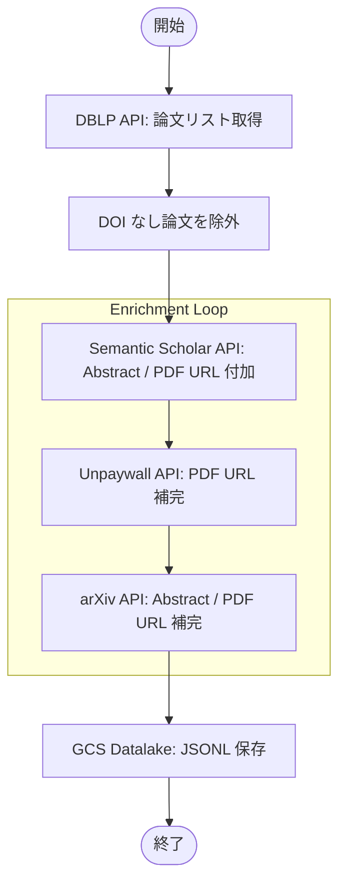

# Crawler

学術論文のメタデータを収集し、充実させるWebクローラー。

DBLP Computer Science Bibliographyから主要な推薦システム・データマイニング系カンファレンスの論文情報を取得し、Semantic Scholar・Unpaywall・arXivの各APIで要約やPDF URLを付加します。最終的にGoogle Cloud Storage（データレイク）へ保存します。

## 対象カンファレンス

- RecSys (ACM Conference on Recommender Systems)
- KDD (Knowledge Discovery and Data Mining)
- WSDM (Web Search and Data Mining)
- WWW (The Web Conference)
- SIGIR (Special Interest Group on Information Retrieval)
- CIKM (Conference on Information and Knowledge Management)

## 処理フロー


```mermaid
graph TD
    Start([開始]) --> DBLP[DBLP API: 論文リスト取得]
    DBLP --> Filter[DOI なし論文を除外]
    Filter --> SS[Semantic Scholar API: Abstract / PDF URL 付加]
    SS --> UP[Unpaywall API: PDF URL 補完]
    UP --> Arxiv[arXiv API: Abstract / PDF URL 補完]
    Arxiv --> GCS[GCS Datalake: JSONL 保存]
    GCS --> End([終了])

    subgraph Enrichment Loop
    SS
    UP
    Arxiv
    end
```

1. **DBLP APIからの基本情報取得**
   - 各カンファレンスでアクセプトされた論文のタイトル、著者、年度、DOIを取得
   - robots.txtを尊重し、適切なレート制限を実施

2. **DOIフィルタリング**
   - DOIが存在しない論文は以降の Enrich 処理に不要なため除外

3. **Semantic Scholarでの充実**
   - DOIを使用して各論文の詳細情報をバッチ取得
   - Abstract（要約）とPDF URLを付加

4. **UnpaywallでのPDF取得**
   - DOIを使用してUnpaywallからオープンアクセスPDFを取得

5. **arXivでの充実**
   - DOIまたはタイトルでarXivを検索
   - AbstractとPDF URLを補完

6. **GCS Datalakeへの保存**
   - 補完済み論文を JSONL 形式でバッチ分割してアップロード

## ディレクトリ構成

```text
workflows/crawler/
├── pyproject.toml
├── config.toml           # サイト設定（将来用）
├── Makefile
├── README.md
├── src/
│   └── crawler/
│       ├── application/
│       │   └── usecases/
│       │       └── crawl_conference_papers.py  # メインユースケース
│       ├── domain/
│       │   ├── enums/
│       │   │   └── __init__.py                 # ConferenceName 列挙型
│       │   ├── models/
│       │   │   └── paper.py                    # Paper ドメインモデル
│       │   └── repositories/
│       │       └── repository.py               # PaperRetriever / PaperEnricher / PaperDatalake プロトコル
│       ├── infrastructure/
│       │   ├── configs/
│       │   │   └── __init__.py                 # Config（環境変数から読み込み）
│       │   ├── http/
│       │   │   ├── http_client.py              # httpx.AsyncClient ファクトリ
│       │   │   ├── http_retry_client.py        # リトライ・レート制限付き HTTP クライアント
│       │   │   └── http_utils.py               # tenacity ヘルパー関数
│       │   └── repositories/
│       │       ├── arxiv_repository.py         # arXiv API 連携
│       │       ├── dblp_repository.py          # DBLP API 連携
│       │       ├── gcs_datalake.py             # GCS への JSONL 保存
│       │       ├── semantic_scholar_repository.py  # Semantic Scholar API 連携
│       │       └── unpaywall_repository.py     # Unpaywall API 連携
│       ├── utils/
│       │   ├── __init__.py                     # RobotGuard（robots.txt 処理）
│       │   └── log.py                          # loguru ロガー設定
│       └── main.py                             # エントリーポイント
└── tests/
    ├── conftest.py
    ├── domain/
    ├── repository/
    ├── usecase/
    └── utils/
```

## 主要コンポーネント

### Domain層

#### `Paper` (`src/crawler/domain/models/paper.py`)

論文のメタデータを表す Pydantic ドメインモデル。

**必須フィールド:**

| フィールド | 型 | 説明 |
|---|---|---|
| `title` | `str` | 論文タイトル |
| `authors` | `list[str]` | 著者名リスト |
| `year` | `int` | 出版年 |
| `venue` | `str` | 掲載会場（カンファレンス名） |

**オプションフィールド:**

| フィールド | 型 | 説明 |
|---|---|---|
| `doi` | `str \| None` | DOI |
| `type` | `str \| None` | 論文種別（例: "Conference and Workshop Papers"） |
| `ee` | `str \| None` | 電子版リンク |
| `pdf_url` | `str \| None` | PDF URL |
| `abstract` | `str \| None` | 要約 |

#### `ConferenceName` (`src/crawler/domain/enums/__init__.py`)

対象カンファレンスを表す `StrEnum`。`ConferenceName.from_str("recsys")` で文字列から変換可能。

#### リポジトリプロトコル (`src/crawler/domain/repositories/repository.py`)

| プロトコル | 役割 |
|---|---|
| `PaperRetriever` | 論文一覧を一次情報源から取得 |
| `PaperEnricher` | 既存論文データに情報を追加補完 |
| `PaperDatalake` | 論文データを外部ストレージに保存 |

### Application層（UseCase）

#### `CrawlConferencePapers` (`src/crawler/application/usecases/crawl_conference_papers.py`)

各リポジトリを組み合わせて、論文情報の取得から保存までの一連のフローを実行するユースケース。

```python
usecase = CrawlConferencePapers(
    conf_name=ConferenceName.RECSYS,
    paper_retriever=dblp_repo,
    paper_enrichers=[ss_repo, unpaywall_repo, arxiv_repo],
    paper_datalake=datalake,
)
papers = await usecase.execute(year=2024)
```

### Infrastructure層

#### `DBLPRepository` (`src/crawler/infrastructure/repositories/dblp_repository.py`)

DBLP Search APIから論文の基本情報を取得する。

- `from_client(client, max_retry_count=...)` でリポジトリを生成
- 使用前に `await repo.setup(client)` で robots.txt をロードする必要あり
- リトライ対象: `429`, `500`

#### `SemanticScholarRepository` (`src/crawler/infrastructure/repositories/semantic_scholar_repository.py`)

Semantic Scholar Graph APIから論文の詳細情報をバッチ取得する。

- `from_client(client, max_retry_count=...)` でリポジトリを生成
- バッチサイズ最大500件
- 取得フィールド: `externalIds`, `abstract`, `openAccessPdf`, `title`, `year`, `venue`, `authors`, `url`

#### `UnpaywallRepository` (`src/crawler/infrastructure/repositories/unpaywall_repository.py`)

Unpaywall APIからオープンアクセスな PDF URL を取得する。

- `from_client(client, email=..., max_retry_count=...)` で初期化
- `email` をクエリパラメータとして使用（デフォルト: `crawler@haru256.dev`）
- 50件ごとのバッチで並列制御

#### `ArxivRepository` (`src/crawler/infrastructure/repositories/arxiv_repository.py`)

arXiv APIから論文情報を取得する。
`from_client(client, max_retry_count=...)` でリポジトリを生成
-

- DOI検索 → 失敗した場合タイトル検索にフォールバック
- 50件ごとのバッチで並列制御（arXiv の1リクエスト/5秒制限と併用）

#### `GCSDatalake` (`src/crawler/infrastructure/repositories/gcs_datalake.py`)

論文データを JSONL 形式でバッチ分割して GCS にアップロードする。

- ファイル名: `{papers_rep_name}_{timestamp}_{uuid}.jsonl`
- デフォルトバッチサイズ: 100件
- 並列アップロード数: 最大5

#### `HttpRetryClient` (`src/crawler/infrastructure/http/http_retry_client.py`)

teコンストラクタで `max_retry_count` を受け取り、リトライ回数を制御

- `Retry-After` ヘッダーがあればそれを待機時間に使用、なければ指数バックオフ
- `GET` / `POST` をサポート
- `retry_statuses`（デフォルト: `{429}`）と `retry_exceptions`（デフォルト: `RequestError`, `ReadError`）をカスタマイズ可能
- `Retry-After` ヘッダーがあればそれを待機時間に使用、なければ指数バックオフ
- `GET` / `POST` をサポート

## セットアップ

### 必要要件

- Python 3.13 以上
- [uv](https://docs.astral.sh/uv/) パッケージマネージャー

### インストール

```bash
cd workflows/crawler
uv sync
```

## 使用方法

### 基本的な実行

```bash
uv run python src/crawler/main.py
```

### 環境変数

| 変数名 | 必須 | デフォルト | 説明 |
|---|---|---|---|
| `GCS_BUCKET_NAME` | **必須** | — | 保存先 GCS バケット名 |
| `GCP_PROJECT_ID` | 任意 | `devgist` | GCP プロジェクト ID |
| `EMAIL` | 任意 | `crawler@haru256.dev` | Unpaywall API 用メールアドレス |
| `CONFERENCE_NAMES` | 任意 | `recsys,kdd,wsdm,www,sigir,cikm` | 対象カンファレンス（カンマ区切り） |
| `YEARS` | 任意 | `2025` | 対象年度（カンマ区切り） |
| `MAX_RETRY_COUNT` | 任意 | `10` | HTTP リクエストの最大リトライ回数 |
| `LOG_LEVEL` | 任意 | `DEBUG` | ログ出力レベル |

ローカル開発では `.env.local` に設定を記述します:

```bash
GCS_BUCKET_NAME=your-bucket-name
GCP_PROJECT_ID=your-project-id
EMAIL=you@example.com
YEARS=2024,2025
```

### プログラムからの使用

```python
import asyncio

from google.cloud import storage

from crawler.application.usecases.crawl_conference_papers import CrawlConferencePapers
from crawler.domain.enums import ConferenceName
from crawler.infrastructure.configs import load_config
from crawler.infrastructure.http.http_client import create_http_client
from crawler.infrastructure.repositories import (
    ArxivRepository,
    DBLPRepository,
    SemanticScholarRepository,
    UnpaywallRepository,
)
from crawler.infrastructure.repositories.gcs_datalake import GCSDatalake


async def fetch_papers() -> None:
    # 設定を読み込み
    cfg = load_config()
    
    headers = {"User-Agent": "DevGistBot/1.0"}

    async with create_http_client(headers=headers) as client:
        # リポジトリ初期化（設定値を注入）
        dblp_repo = DBLPRepository.from_client(client, max_retry_count=cfg.max_retry_count)
        await dblp_repo.setup(client)  # robots.txt のロードが必要
        ss_repo = SemanticScholarRepository.from_client(client, max_retry_count=cfg.max_retry_count)
        unpaywall_repo = UnpaywallRepository.from_client(
            client, 
            email=cfg.email,
            max_retry_count=cfg.max_retry_count,
        )
        arxiv_repo = ArxivRepository.from_client(client, max_retry_count=cfg.max_retry_count)

        # GCS Datalake 初期化
        storage_client = storage.Client(project=cfg.gcp_project_id)
        datalake = GCSDatalake(
            storage_client=storage_client,
            bucket_name=cfg.gcs_bucket_name,
        )

        # ユースケース実行
        usecase = CrawlConferencePapers(
            conf_name=ConferenceName.RECSYS,
            paper_retriever=dblp_repo,
            paper_enrichers=[ss_repo, unpaywall_repo, arxiv_repo],
            paper_datalake=datalake,
        )
        papers = await usecase.execute(year=2024)
        print(f"Fetched {len(papers)} papers")


if __name__ == "__main__":
    asyncio.run(fetch_papers())
```

## テスト

### 全テストの実行

```bash
uv run pytest
```

### 並列実行（高速化）

```bash
uv run pytest -n auto
```

## コード品質チェック

### 型チェック

```bash
uv run mypy .
```

### リントチェック

```bash
uv run ruff check .
```

### Makefileターゲット

```bash
make lint
make test
```

## アーキテクチャの特徴

### レイヤードアーキテクチャ

```
application/usecases/   ← ビジネスロジック（外部依存なし）
domain/                 ← ドメインモデル・インターフェース定義
infrastructure/         ← 外部API・ストレージの具体実装
utils/                  ← 汎用ユーティリティ
```

ドメイン層はインフラ層に依存しないため、テスト時はモックと差し替え可能です。

### 非同期処理

全ての HTTP 通信は `httpx` の `AsyncClient` を使用。
`asyncio.TaskGroup` で並列処理しつつ、バッチサイズで同時タスク数を制限します。

```
enrich_papers(papers)
  └─ for batch in chunks(papers, BATCH_SIZE=50):
       └─ TaskGroup
            ├─ _enrich_single_paper(paper_0)
            ├─ _enrich_single_paper(paper_1)
            └─ ...
```

### 共有HTTPクライアントとリソース管理

設定値（`max_retry_count`、`email` など）は composition root（`main.py`）で
`Config` から取得し、各コンポーネントに明示的に注入します（Dependency Injection）。

```python
cfg = load_config()
async with create_http_client(headers=headers) as client:
    dblp_repo  = DBLPRepository.from_client(client, max_retry_count=cfg.max_retry_count)
    ss_repo    = SemanticScholarRepository.from_client(client, max_retry_count=cfg.max_retry_cou
```python
async with create_http_client(headers=headers) as client:
    dblp_repo  = DBLPRepository.from_client(client)
    ss_repo    = SemanticScholarRepository.from_client(client)
    ...
```

### レート制限・並列制御

各リポジトリは `aiolimiter.AsyncLimiter` と `asyncio.Semaphore` を組み合わせて、
外部 API への過度なリクエストを防ぎます。

| リポジトリ | Semaphore（同時接続） | Limiter（レート） |
|---|---|---|
| DBLP | 5 | 1 req / 1 sec |
| Semantic Scholar | 5 | 1 req / 0.1 sec |
| Unpaywall | 5 | 1 req / 0.1 sec |
| arXiv | 1 | 1 req / 5 sec |

### 例外処理方針

各リポジトリは HTTP エラー・タイムアウト・ネットワークエラー・想定外エラーを
個別に捕捉してログ出力し、`None` を返して後続処理を継続させます。

| 例外種別 | ログレベル | 動作 |
|---|---|---|
| `HTTPStatusError` (4xx/5xx) | `WARNING` | `None` を返す |
| `TimeoutException` | `WARNING` | `None` を返す |
| `RequestError` | `WARNING` | `None` を返す |
| 想定外 (`Exception`) | `ERROR` | `None` を返す |
| XML パースエラー (`ArxivXMLParseError`) | `WARNING` | `None` を返す |

## 注意事項

### robots.txtの尊重

`DBLPRepository` は `robots.txt` を自動チェックし、クロールが許可されている
場合のみリクエストを実行します。使用前に `await repo.setup(client)` を呼び出してください。

### User-Agent

必ず適切な User-Agent を設定してください。

```python
headers = {"User-Agent": "YourBotName/1.0 (contact@example.com)"}
```

### HTTP クライアント共有時の注意

`HttpRetryClient` は `asyncio.Semaphore` と `AsyncLimiter` をインスタンスごとに
持つため、同一 `httpx.AsyncClient` を複数のリポジトリで共有しても
レート制限はリポジトリ単位で独立して機能します。

## 開発

### 新しい依存関係の追加

```bash
uv add package-name
```

### 開発依存関係の追加

```bash
uv add --group dev package-name
```

### 新しいリポジトリの追加

1. `src/crawler/infrastructure/repositories/` に実装クラスを追加
2. `PaperEnricher` または `PaperRetriever` プロトコルに準拠させる
3. `src/crawler/infrastructure/repositories/__init__.py` に export を追加
4. `tests/repository/` にユニットテストを追加

## ライセンス

このプロジェクトは教育・研究目的で使用されます。外部APIの利用規約を遵守してください。
